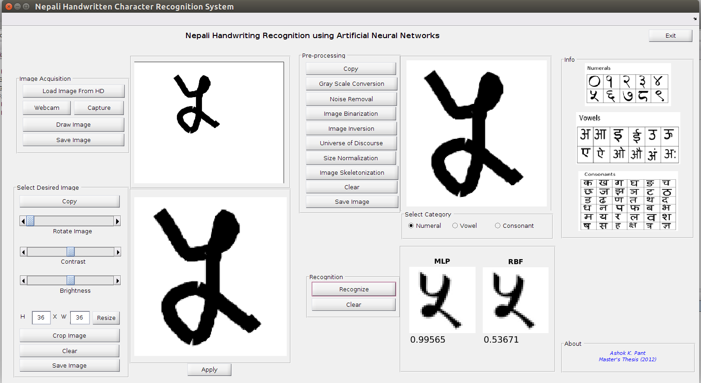
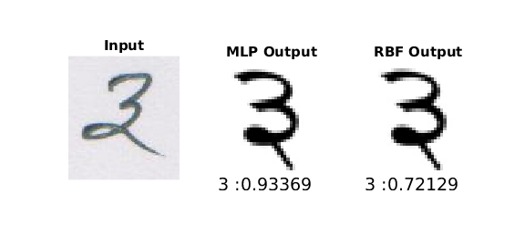
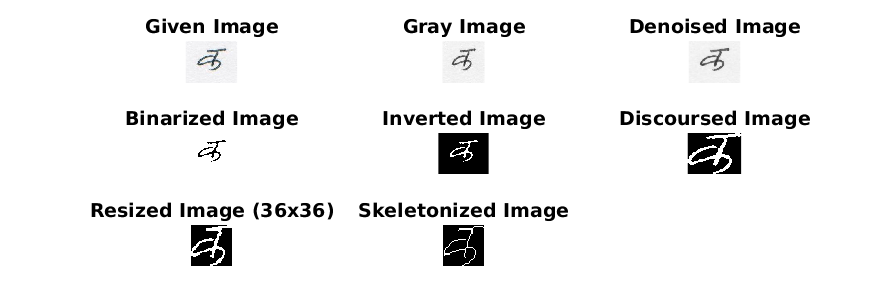

# nhcr: Nepali Handwritten Character Recognition
 Offline Nepali Handwritten Character Recognition Using Artificial Neural Networks

## Requirement
1. MATLAB


## Uses
### Change configurations
Change your configurations in 'setup.m' file if necessary.

### Set path
```matlab
#Add anpr project path to matlab search path using set path option. OR,
>> addpath(genpath(pwd))
```

### GUI
```matlab
>> cd gui
>> handwritingRecognition
```


### Training/Evaluation
```matlab
>> main.m
```
### Examples
**Recognition Test**
```matlab
>> recognitionTest()
```


**Image Pre-processing Demo**
```matlab
>> preprocessingDemo
```


**Feature Extraction Demo**
```matlab
>> featureExtractionDemo
```
## Citation
```
Please cite in your publications if it helps your research:

@inproceedings{pant2012off,
  title={Off-line Nepali handwritten character recognition using Multilayer Perceptron and Radial Basis Function neural networks},
  author={Pant, Ashok Kumar and Panday, Sanjeeb Prasad and Joshi, Shashidhar Ram},
  booktitle={Internet (AH-ICI), 2012 Third Asian Himalayas International Conference on},
  pages={1--5},
  year={2012},
  organization={IEEE}
}
```
